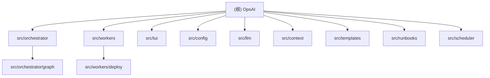

# CLAUDE.md

This file provides guidance to Claude Code (claude.ai/code) when working with code in this repository.

## 变更记录 (Changelog)

| 时间 | 操作 | 说明 |
|------|------|------|
| 2026-02-19 21:48:49 | 全量扫描生成 | 初始化架构师全仓扫描，生成根级及 9 个模块级 CLAUDE.md |

## 项目愿景

OpsAI 是一个基于 LLM 的终端智能运维助手（v0.2.0），采用 Orchestrator-Workers 架构，通过自然语言驱动 ReAct (Reason-Act) 循环，实现运维诊断、部署、监控的自动化。支持 CLI 单次查询和 TUI 交互式会话两种模式。

## 架构总览

核心设计理念：**Orchestrator 负责推理决策，Workers 保持"愚蠢"仅负责执行**。

```
用户输入 (自然语言)
    |
    v
+-------------------+     +-------------------+
|   CLI (typer)     |     |  TUI (textual)    |
+-------------------+     +-------------------+
    |                         |
    v                         v
+------------------------------------------+
|        OrchestratorEngine                |
|  +-----------+   +-------------------+   |
|  | LLMClient |   | PromptBuilder     |   |
|  +-----------+   +-------------------+   |
|  +---------------------------------------+
|  |         ReactGraph (LangGraph)        |
|  | preprocess -> reason -> safety ->     |
|  | [approve?] -> execute -> check ->     |
|  | [loop/end]                            |
|  +---------------------------------------+
+------------------------------------------+
    |
    v
+------------------------------------------+
|              Workers (16+)               |
| system | shell | container | compose     |
| deploy | analyze | monitor | log_analyzer|
| http | git | audit | chat | kubernetes   |
| remote | notifier | file_ops             |
+------------------------------------------+
    |
    v
+------------------------------------------+
|           支撑层                          |
| config/ | context/ | templates/          |
| runbooks/ | scheduler/ | llm/presets     |
+------------------------------------------+
```

## 模块结构图 (Mermaid)



## 模块索引

| 模块路径 | 语言 | 职责 | 入口文件 | 测试覆盖 |
|----------|------|------|----------|----------|
| `src/orchestrator/` | Python | ReAct 引擎、Prompt 构建、安全策略、LangGraph 状态图 | `engine.py` | 有 (10+ 测试文件) |
| `src/workers/` | Python | 16+ Worker 执行器（system/shell/container/deploy/monitor等） | `base.py` | 有 (20+ 测试文件) |
| `src/tui/` | Python | Textual TUI 交互界面、健康仪表盘 | `app.py` | 有 |
| `src/config/` | Python | Pydantic 配置模型、ConfigManager | `manager.py` | 有 |
| `src/llm/` | Python | OpenAI SDK 封装、模型预设、Function Calling | `client.py` | 有 |
| `src/context/` | Python | 环境检测、会话记忆、变更追踪 | `environment.py` | 有 |
| `src/templates/` | Python | 任务模板管理与执行 | `manager.py` | 有 |
| `src/runbooks/` | Python | YAML 诊断手册加载与匹配 | `loader.py` | 有 |
| `src/scheduler/` | Python | Cron 表达式定时任务调度 | `scheduler.py` | 有 |

## 运行与开发

### Setup
```bash
uv sync                          # 安装依赖
uv tool install .                # 安装为可执行工具
```

### Running
```bash
uv run opsai query "检查磁盘使用情况"              # CLI 单次查询
uv run opsai query "删除临时文件" --dry-run         # Dry-run 模式
uv run opsai-tui                                    # TUI 交互式会话
uv run opsai deploy https://github.com/user/app     # 一键部署
uv run opsai config show                            # 查看配置
uv run opsai config list-presets                    # 列出模型预设
uv run opsai config use-preset openai-gpt4o --api-key sk-xxx  # 切换模型
uv run opsai template list                          # 列出任务模板
uv run opsai template run disk_cleanup --dry-run    # 运行模板
uv run opsai cache list                             # 查看分析缓存
uv run opsai host add 192.168.1.100                 # 添加远程主机
uv run opsai host test 192.168.1.100                # 测试 SSH 连接
```

### Testing
```bash
uv run pytest                                       # 运行所有测试
uv run pytest tests/test_container_worker.py        # 运行单个测试
uv run pytest --cov=src --cov-report=term-missing   # 带覆盖率
```

### Code Quality
```bash
uv run mypy src/                  # 类型检查（strict 模式）
uv run ruff format src/ tests/    # 格式化
uv run ruff check src/ tests/     # Linting
```

## 测试策略

- **单元测试**: 测试单个 Worker 的 action 实现（`test_container_worker.py`, `test_workers_system.py` 等）
- **集成测试**: 测试 Orchestrator 与 Worker 的交互（`test_integration.py`, `test_engine.py`）
- **Dry-run 测试**: 验证破坏性操作的模拟执行逻辑（`test_dry_run.py`）
- **策略测试**: 安全策略、风险分析、命令白名单（`test_safety.py`, `test_risk_analyzer.py`, `test_command_whitelist.py`）
- **端到端**: Deploy 全流程（`test_deploy_integration.py`, `test_deploy_worker.py`）
- 框架: `pytest` + `pytest-asyncio`，异步测试 `asyncio_mode = "auto"`

## 编码规范

- Python 3.9+ 兼容性（使用 `Union` 而非 `|` 语法，`pyproject.toml` 中 ignore `UP007`/`UP045`）
- **严格禁止 `any` 类型** -- `mypy --strict` + `disallow_any_explicit = true`
- 行长度限制: 100 字符
- 所有类型定义放在 `src/types.py`（单文件超 500 行需拆分）
- 使用 `from __future__ import annotations` 启用延迟注解
- 异步函数使用 `async def`，返回类型必须显式标注
- Ruff 规则: `E, F, I, N, W, UP, ANN, B, C4, SIM`
- 提交信息: `feat:` / `fix:` / `refactor:` / `docs:` / `test:` 约定式格式

## AI 使用指引

### 添加新 Worker

1. 继承 `BaseWorker` (`src/workers/base.py`)
2. 实现四个方法/属性:
   - `name` (property): 返回 Worker 标识符
   - `description` (property): 功能描述，供 LLM 理解何时使用
   - `get_capabilities()`: 返回 action 名称列表
   - `get_actions()`: 返回 `ToolAction` 列表（含参数 schema，供 Function Calling）
   - `execute(action, args)`: 实现具体逻辑
3. 在 `orchestrator/engine.py` 的 `__init__` 中注册 Worker 实例
4. Prompt 工具描述从 Worker 元数据**动态生成**，无需手动编辑 prompt

参考实现: `src/workers/container.py`, `src/workers/monitor.py`

### 关键类型

- `Instruction`: Orchestrator -> Worker 的指令（worker, action, args, risk_level, dry_run）
- `WorkerResult`: Worker -> Orchestrator 的结果（success, data, message, task_completed, simulated）
- `ReactState`: LangGraph 状态（TypedDict，包含 iteration/instruction/result/approval 等）
- `OpsAIConfig`: 完整配置 Pydantic 模型（llm/safety/audit/http/tui/monitor/notifications/remote）

### 安全机制

- 风险三级: `safe`（只读自动执行）/ `medium`（TUI 需确认）/ `high`（TUI 需确认，CLI 拒绝）
- Shell 命令白名单校验: `orchestrator/command_whitelist.py` + `whitelist_rules.py`
- 危险模式检测: `orchestrator/policy_engine.py` 的 `DANGER_PATTERNS`
- 高危操作强制 dry-run: `safety.require_dry_run_for_high_risk`

### 配置

配置文件: `~/.opsai/config.json`（Pydantic 模型自动创建默认值）
- `llm`: model, base_url, api_key, timeout, max_tokens, temperature, supports_function_calling, context_window
- `safety`: auto_approve_safe, cli_max_risk, tui_max_risk, dry_run_by_default, require_dry_run_for_high_risk
- `audit`: log_path, max_log_size_mb, retain_days
- `http`: timeout, github_token
- `monitor`: cpu/memory/disk warning/critical 阈值
- `notifications`: enabled, channels, watch_interval, alert_duration, alert_cooldown
- `remote`: hosts, default_key_path, connect_timeout, command_timeout

### Dry-run 模式

所有支持 dry-run 的 Worker 必须:
1. 在 `args` 中接受 `dry_run: bool` 参数
2. 如果 `dry_run=True`，模拟执行并返回 `simulated=True`
3. 在 message 中标注 "[DRY-RUN]" 前缀
4. Orchestrator 在 `engine.py` 中自动注入 dry_run 参数
