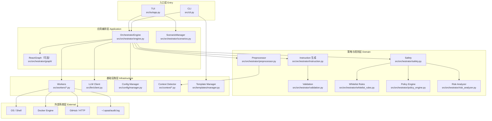

# OpsAI - 终端智能运维助手

> 用自然语言操作服务器，无需记命令

**核心能力**：查日志 · 查状态 · 重启服务 · 检查资源 · 文件操作 · Git 管理 · 一键部署 · 系统监控 · 智能分析

## 系统架构图



分层说明：上层负责交互与编排，中层负责规则与安全决策，下层负责具体执行与外部系统交互，层间依赖单向向下，便于测试、替换与扩展。

## 快速开始

### 1. 安装

```bash
pip install opsai
# 或
uv tool install opsai
```

### 1.1 克隆仓库后一键安装（推荐开发/自托管）

```bash
git clone https://github.com/yourusername/opsai.git
cd opsai
# 方式 A
python3 install.py
# 方式 B
./install.sh
```

说明：
- 脚本会创建 `~/.opsai/venv` 独立环境
- 自动安装当前仓库并生成 `~/.local/bin/opsai`、`~/.local/bin/opsai-tui`
- 若提示 PATH 未包含 `~/.local/bin`，按提示追加到 `~/.zshrc` 或 `~/.bashrc`

### 2. 启动

```bash
opsai-tui
```

### 3. 试试这些命令

```
> 查看所有容器
> 查看磁盘空间
> 查看最近的日志
> 克隆 https://github.com/user/repo
> 检查 80 端口是否开放
> 查看 CPU 占用最高的进程
```

---

## 常见场景

<details>
<summary><b>服务出问题了</b></summary>

```bash
opsai-tui
> "我的网站打不开"
# → 自动检测 nginx 容器状态 + 端口监听 + 查看日志

> "查看 api-server 的日志"
# → 自动识别容器，显示最近日志

> "重启 nginx"
# → 安全确认后执行重启，并验证启动成功
```
</details>

<details>
<summary><b>磁盘空间不足</b></summary>

```bash
opsai-tui
> "磁盘快满了，帮我清理"
# → 自动查找大文件 + 建议可清理的内容 + 安全删除
```
</details>

<details>
<summary><b>部署 GitHub 项目</b></summary>

```bash
# 一键部署（自动检测项目类型）
opsai deploy https://github.com/user/my-app

# 或通过 TUI
opsai-tui
> "帮我部署 https://github.com/user/my-app"
```
</details>

<details>
<summary><b>Git 仓库管理</b></summary>

```bash
opsai-tui
> "克隆 https://github.com/user/repo 到 ~/projects"
> "拉取最新代码"
> "查看 git 状态"
```
</details>

<details>
<summary><b>文件操作</b></summary>

```bash
opsai-tui
> "写入配置到 /etc/app/config.yaml"
> "在日志文件末尾追加一行"
> "把配置文件里的 localhost 替换成 192.168.1.100"
```
</details>

<details>
<summary><b>系统监控</b></summary>

```bash
opsai-tui
> "查看系统资源状态"
# → CPU/内存/磁盘/负载一览，含告警阈值判定

> "检查 80 端口是否开放"
> "检查 https://example.com 是否可达"
> "查看 nginx 进程是否在运行"
> "查看 CPU 占用最高的 10 个进程"

# 或使用斜杠命令快速查看
/monitor
```
</details>

<details>
<summary><b>智能分析</b></summary>

```bash
opsai-tui
> "分析一下 my-app 容器的状态"
# → 自动采集信息 + LLM 生成分析总结
# → 分析模板会缓存，相同类型下次更快
```
</details>

---

## 功能一览

### Workers 能力

| Worker | 功能 | 操作 |
|--------|------|------|
| **system** | 系统操作 | 列出文件、查找大文件、检查磁盘、删除文件、写入文件、追加内容、替换内容 |
| **container** | Docker 管理 | 列出容器、查看详情、获取日志、重启、停止、启动、资源统计 |
| **monitor** | 系统监控 | 资源快照、端口检测、HTTP 探活、进程检查、Top 进程排序 |
| **git** | Git 操作 | clone、pull、status |
| **shell** | 命令执行 | 执行白名单内的 shell 命令（含安全策略） |
| **http** | 网络请求 | 获取 URL、获取 GitHub README、列出仓库文件 |
| **deploy** | 一键部署 | LLM 驱动的智能部署（自动分析项目类型 + 错误诊断重试） |
| **analyze** | 智能分析 | 解释命令输出和错误信息（含模板缓存加速） |
| **chat** | 对话处理 | 处理问候、闲聊等非运维对话 |
| **audit** | 审计日志 | 记录所有实际执行的操作 |

### TUI 斜杠命令

| 命令 | 说明 |
|------|------|
| `/help` | 显示帮助信息 |
| `/scenario` | 查看运维场景（`/scenario <id>` 查看详情，`/scenario search <关键词>` 搜索） |
| `/clear` | 清空当前对话历史和上下文 |
| `/config` | 显示当前配置（敏感字段自动脱敏） |
| `/history` | 显示会话历史摘要（`/history <N>` 或 `/history all`） |
| `/pwd` | 显示当前工作目录 |
| `/export` | 导出会话记录（`/export [json\|md] [path]`） |
| `/theme` | 切换明暗主题（`/theme toggle\|on\|off`） |
| `/verbose` | 思考过程展示开关（`/verbose on\|off\|toggle`） |
| `/status` | 状态栏开关（`/status on\|off\|toggle`） |
| `/copy` | 复制输出（`/copy all\|N\|mode`） |
| `/monitor` | 系统资源快照表格（CPU/内存/磁盘/负载 + 状态判定） |
| `/exit` | 退出 |

### TUI 快捷键

| 快捷键 | 功能 |
|--------|------|
| `Ctrl+C` | 退出 |
| `Ctrl+L` | 清空对话 |
| `Ctrl+Y` | 进入/退出复制模式（选中文本后 Ctrl+C 复制） |
| `Escape` | 退出复制模式 |

### 运维场景系统

内置 8 个预置场景，覆盖四大分类，支持环境自动推荐：

| 分类 | 场景 | 说明 |
|------|------|------|
| 故障排查 | `service_down` | 服务无响应诊断与修复 |
| 故障排查 | `high_cpu` | CPU 占用过高排查 |
| 故障排查 | `high_memory` | 内存占用过高排查 |
| 日常维护 | `disk_full` | 磁盘空间清理 |
| 日常维护 | `clean_docker` | Docker 资源清理 |
| 项目部署 | `deploy_github` | 一键部署 GitHub 项目 |
| 项目部署 | `update_service` | 拉取最新代码并重启服务 |
| 监控查看 | `check_logs` | 快速定位服务日志错误 |
| 监控查看 | `check_status` | 全面检查系统健康度 |

首次启动时自动检测环境（磁盘/内存/Docker/Kubernetes），智能推荐适合的场景。

---

## 安全保障

- **危险操作拦截**：自动识别 `rm -rf`, `kill -9` 等高危命令
- **命令白名单**：ShellWorker 基于白名单执行，禁止命令链接和危险重定向
- **风险分析器**：多维度评估命令风险（命令白名单 + 策略引擎 + 参数分析）
- **分模式风险控制**：CLI/TUI 分别使用不同风险上限（`cli_max_risk`、`tui_max_risk`）
- **二次确认**：TUI 下 `medium/high` 默认需要确认；`safe` 可通过配置要求确认
- **Dry-run 模式**：预览操作，不实际执行
- **高危先演练**：可配置 `high` 操作必须先 dry-run
- **审计日志**：实际执行操作记录到 `~/.opsai/audit.log`（dry-run 不记录）

### 风险等级

| 等级 | 操作示例 | CLI 模式 | TUI 模式 |
|------|----------|----------|----------|
| safe | ls, df, docker ps | 允许（受 `cli_max_risk` 控制） | 默认自动通过（可关闭） |
| medium | touch, mkdir, restart | 允许/阻止（取决于 `cli_max_risk`） | 允许（默认需确认） |
| high | rm -rf, kill -9 | 允许/阻止（取决于 `cli_max_risk`，且可要求先 dry-run） | 允许（默认需确认，且可要求先 dry-run） |

---

## 进阶使用

### 配置 LLM

```bash
# 使用本地 Ollama（推荐）
opsai config set-llm --model qwen2.5:7b --base-url http://localhost:11434/v1

# 使用 OpenAI
opsai config set-llm --model gpt-4o --api-key sk-xxx

# 设置采样温度
opsai config set-llm --model qwen2.5:7b --temperature 0.1

# 查看当前配置
opsai config show
```

### 配置 HTTP / GitHub Token

```bash
# 设置 GitHub Token（用于私有仓库和提高 rate limit）
opsai config set-http --github-token ghp_xxxx

# 设置请求超时时间
opsai config set-http --timeout 60
```

### CLI 模式

```bash
opsai query "查看磁盘使用情况"
opsai query "列出所有容器" --dry-run
```

### 一键部署

```bash
# 部署 GitHub 项目到默认目录
opsai deploy https://github.com/user/my-app

# 指定部署目录
opsai deploy https://github.com/user/my-app --target-dir ~/myprojects

# 预览部署（不实际执行）
opsai deploy https://github.com/user/my-app --dry-run
```

### 任务模板

```bash
# 列出所有模板
opsai template list

# 查看模板详情
opsai template show disk_cleanup

# 运行模板
opsai template run disk_cleanup

# Dry-run 模式预览
opsai template run disk_cleanup --dry-run

# 带上下文变量
opsai template run service_restart --context '{"container_id": "my-app"}'
```

预置模板：

| 模板名称 | 说明 |
|----------|------|
| disk_cleanup | 磁盘空间清理 |
| container_health_check | 容器健康检查 |
| service_restart | 服务重启流程 |
| log_analysis | 日志错误分析 |

### 缓存管理

```bash
# 列出缓存的分析模板
opsai cache list

# 查看指定类型的缓存详情
opsai cache show docker

# 清除所有缓存
opsai cache clear

# 清除指定类型缓存
opsai cache clear docker

# 强制清除（不询问确认）
opsai cache clear -f
```

---

## 配置文件

配置文件位于 `~/.opsai/config.json`：

```json
{
  "llm": {
    "model": "qwen2.5:7b",
    "base_url": "http://localhost:11434/v1",
    "api_key": "",
    "timeout": 30,
    "max_tokens": 2048,
    "temperature": 0.2
  },
  "safety": {
    "auto_approve_safe": true,
    "cli_max_risk": "safe",
    "tui_max_risk": "high",
    "dry_run_by_default": false,
    "require_dry_run_for_high_risk": true
  },
  "audit": {
    "log_path": "~/.opsai/audit.log",
    "max_log_size_mb": 100,
    "retain_days": 90
  },
  "http": {
    "timeout": 30,
    "github_token": ""
  },
  "tui": {
    "show_thinking": false
  },
  "monitor": {
    "cpu_warning": 80.0,
    "cpu_critical": 95.0,
    "memory_warning": 80.0,
    "memory_critical": 95.0,
    "disk_warning": 85.0,
    "disk_critical": 95.0
  }
}
```

关键字段说明：

| 分组 | 字段 | 说明 |
|------|------|------|
| `safety` | `cli_max_risk` | CLI 最大允许风险，超出则直接拒绝 |
| `safety` | `tui_max_risk` | TUI 最大允许风险，超出则直接拒绝 |
| `safety` | `auto_approve_safe` | 在 TUI 中是否自动通过 `safe` 操作 |
| `safety` | `require_dry_run_for_high_risk` | 启用后，`high` 风险操作必须先走 dry-run |
| `safety` | `dry_run_by_default` | 全局默认 dry-run |
| `audit` | `log_path` / `max_log_size_mb` / `retain_days` | 审计日志路径、大小上限与保留天数 |
| `tui` | `show_thinking` | 是否在 TUI 内容区展示 LLM 思考过程 |
| `monitor` | `*_warning` / `*_critical` | 监控指标告警与严重告警阈值（百分比） |

---

## CLI 命令速查

```
opsai --version                       # 查看版本
opsai query "<请求>" [--dry-run]       # 单次自然语言查询
opsai deploy <repo_url> [options]     # 一键部署 GitHub 项目
opsai config show                     # 查看当前配置
opsai config set-llm [options]        # 设置 LLM 配置
opsai config set-http [options]       # 设置 HTTP 配置
opsai template list                   # 列出所有模板
opsai template show <name>            # 查看模板详情
opsai template run <name> [options]   # 运行任务模板
opsai cache list                      # 列出分析缓存
opsai cache show <type>               # 查看缓存详情
opsai cache clear [type] [-f]         # 清除缓存
opsai-tui                             # 启动 TUI 交互模式
```

---

## 常见问题

**Q: 支持哪些运维工具？**
A: Docker、Git、Systemd、通用 Shell 命令、HTTP 探活、系统资源监控。

**Q: 需要 root 权限吗？**
A: 不需要。继承当前用户权限，不涉及提权。

**Q: 数据安全吗？**
A: 所有数据在本地处理，不上传到云端（LLM API 除外）。

**Q: Dry-run 是否记录审计日志？**
A: 不记录。Dry-run 仅模拟，不触发实际操作。

**Q: Shell 命令执行有什么限制？**
A: ShellWorker 使用白名单模式，禁止命令链接（`&&`, `||`, `;`）和危险重定向，管道只允许接安全的文本处理命令。

**Q: 如何卸载？**
A: `pip uninstall opsai` + 删除 `~/.opsai/` 目录。

---

## 开发

```bash
# 克隆仓库
git clone https://github.com/yourusername/opsai.git
cd opsai

# 安装依赖
uv sync

# 运行测试
uv run pytest

# 运行带覆盖率的测试
uv run pytest --cov=src --cov-report=term-missing

# 类型检查
uv run mypy src/

# 代码格式化
uv run ruff format src/ tests/

# Linting
uv run ruff check src/ tests/
```

### 技术栈

| 组件 | 技术 |
|------|------|
| CLI 框架 | Typer + Rich |
| TUI 框架 | Textual |
| LLM 客户端 | OpenAI SDK（兼容 Ollama/OpenAI/各类 API） |
| 配置管理 | Pydantic v2 |
| 编排引擎 | 自研 ReAct 循环 + LangGraph（可选） |
| 系统监控 | psutil |
| HTTP 客户端 | httpx |
| 测试 | pytest + pytest-asyncio |
| 类型检查 | mypy --strict |
| 代码规范 | ruff |

详细功能说明见 [docs/NEW_FEATURES.md](docs/NEW_FEATURES.md)

## License

MIT License
