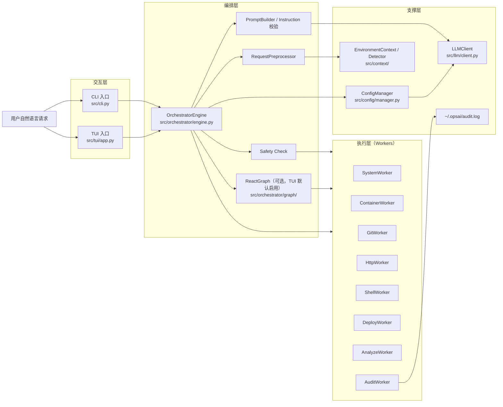

# OpsAI - 终端智能运维助手

> 用自然语言操作服务器，无需记命令

**核心能力**：查日志 · 查状态 · 重启服务 · 检查资源 · 文件操作 · Git 管理 · 一键部署

## 系统架构图



执行链路：用户请求从 CLI/TUI 进入编排引擎，经过意图预处理、指令生成与安全检查后，路由到对应 Worker 执行，并将关键操作写入审计日志。

## 快速开始

### 1. 安装
```bash
pip install opsai
# 或
uv tool install opsai
```

### 2. 启动
```bash
opsai-tui
```

### 3. 试试这些命令
```
> 查看所有容器
> 查看磁盘空间
> 查看最近的日志
> 克隆 https://github.com/user/repo
```

---

## 常见场景

<details>
<summary><b>服务出问题了</b></summary>

```bash
opsai-tui
> "我的网站打不开"
# → 自动检测 nginx 容器状态 + 端口监听 + 查看日志

> "查看 api-server 的日志"
# → 自动识别容器，显示最近日志

> "重启 nginx"
# → 安全确认后执行重启，并验证启动成功
```
</details>

<details>
<summary><b>磁盘空间不足</b></summary>

```bash
opsai-tui
> "磁盘快满了，帮我清理"
# → 自动查找大文件 + 建议可清理的内容 + 安全删除
```
</details>

<details>
<summary><b>部署 GitHub 项目</b></summary>

```bash
# 一键部署（自动检测项目类型）
opsai deploy https://github.com/user/my-app

# 或通过 TUI
opsai-tui
> "帮我部署 https://github.com/user/my-app"
```
</details>

<details>
<summary><b>Git 仓库管理</b></summary>

```bash
opsai-tui
> "克隆 https://github.com/user/repo 到 ~/projects"
> "拉取最新代码"
> "查看 git 状态"
```
</details>

<details>
<summary><b>文件操作</b></summary>

```bash
opsai-tui
> "写入配置到 /etc/app/config.yaml"
> "在日志文件末尾追加一行"
> "把配置文件里的 localhost 替换成 192.168.1.100"
```
</details>

---

## 功能一览

### Workers 能力

| Worker | 功能 | 操作 |
|--------|------|------|
| **system** | 系统操作 | 列出文件、查找大文件、检查磁盘、删除文件、写入文件、追加内容、替换内容 |
| **container** | Docker 管理 | 列出容器、查看详情、获取日志、重启、停止、启动、资源统计 |
| **git** | Git 操作 | clone、pull、status |
| **shell** | 命令执行 | 执行任意 shell 命令 |
| **http** | 网络请求 | 获取 URL、获取 GitHub README、列出仓库文件 |
| **deploy** | 一键部署 | 自动分析项目类型并部署 |
| **analyze** | 智能分析 | 解释命令输出和错误信息 |
| **audit** | 审计日志 | 记录所有操作 |

### TUI 斜杠命令

| 命令 | 说明 |
|------|------|
| `/help` | 显示帮助信息 |
| `/config` | 查看当前配置 |
| `/clear` | 清空对话历史 |
| `/history` | 查看历史记录 |

---

## 安全保障

- **危险操作拦截**：自动识别 `rm -rf`, `kill -9` 等高危命令
- **分模式风险控制**：CLI/TUI 分别使用不同风险上限（`cli_max_risk`、`tui_max_risk`）
- **二次确认**：TUI 下 `medium/high` 默认需要确认；`safe` 可通过配置要求确认
- **Dry-run 模式**：预览操作，不实际执行
- **高危先演练**：可配置 `high` 操作必须先 dry-run
- **审计日志**：实际执行操作记录到 `~/.opsai/audit.log`（dry-run 不记录）

### 风险等级

| 等级 | 操作示例 | CLI 模式 | TUI 模式 |
|------|----------|----------|----------|
| safe | ls, df, docker ps | 允许（受 `cli_max_risk` 控制） | 默认自动通过（可关闭） |
| medium | touch, mkdir, restart | 允许/阻止（取决于 `cli_max_risk`） | 允许（默认需确认） |
| high | rm -rf, kill -9 | 允许/阻止（取决于 `cli_max_risk`，且可要求先 dry-run） | 允许（默认需确认，且可要求先 dry-run） |

---

## 进阶使用

### 配置 LLM
```bash
# 使用本地 Ollama（推荐）
opsai config set-llm --model qwen2.5:7b --base-url http://localhost:11434/v1

# 使用 OpenAI
opsai config set-llm --model gpt-4o --api-key sk-xxx

# 查看当前配置
opsai config show
```

### CLI 模式
```bash
opsai query "查看磁盘使用情况"
opsai query "列出所有容器" --dry-run
```

### 一键部署
```bash
# 部署 GitHub 项目到默认目录
opsai deploy https://github.com/user/my-app

# 指定部署目录
opsai deploy https://github.com/user/my-app --target-dir ~/myprojects

# 预览部署（不实际执行）
opsai deploy https://github.com/user/my-app --dry-run
```

### 任务模板
```bash
# 列出所有模板
opsai template list

# 运行模板
opsai template run disk_cleanup

# Dry-run 模式预览
opsai template run disk_cleanup --dry-run

# 带上下文变量
opsai template run service_restart --context '{"container_id": "my-app"}'
```

预置模板：
| 模板名称 | 说明 |
|----------|------|
| disk_cleanup | 磁盘空间清理 |
| container_health_check | 容器健康检查 |
| service_restart | 服务重启流程 |
| log_analysis | 日志错误分析 |

### 缓存管理
```bash
opsai cache clear
```

---

## 配置文件

配置文件位于 `~/.opsai/config.json`：

```json
{
  "llm": {
    "model": "qwen2.5:7b",
    "base_url": "http://localhost:11434/v1",
    "api_key": "",
    "timeout": 30,
    "max_tokens": 2048,
    "temperature": 0.2
  },
  "safety": {
    "auto_approve_safe": true,
    "cli_max_risk": "safe",
    "tui_max_risk": "high",
    "dry_run_by_default": false,
    "require_dry_run_for_high_risk": true
  },
  "audit": {
    "log_path": "~/.opsai/audit.log",
    "max_log_size_mb": 100,
    "retain_days": 90
  },
  "http": {
    "timeout": 30,
    "github_token": ""
  }
}
```

关键字段说明：
- `cli_max_risk`：CLI 最大允许风险，超出则直接拒绝。
- `tui_max_risk`：TUI 最大允许风险，超出则直接拒绝。
- `auto_approve_safe`：在 TUI 中是否自动通过 `safe` 操作。
- `require_dry_run_for_high_risk`：启用后，`high` 风险操作必须先走 dry-run。
- `dry_run_by_default`：全局默认 dry-run。
- `audit.log_path / max_log_size_mb / retain_days`：审计日志路径、大小上限与保留天数。

---

## 常见问题

**Q: 支持哪些运维工具？**
A: Docker、Git、Systemd、通用 Shell 命令。

**Q: 需要 root 权限吗？**
A: 不需要。继承当前用户权限，不涉及提权。

**Q: 数据安全吗？**
A: 所有数据在本地处理，不上传到云端（LLM API 除外）。

**Q: Dry-run 是否记录审计日志？**
A: 不记录。Dry-run 仅模拟，不触发实际操作。

**Q: 如何卸载？**
A: `pip uninstall opsai` + 删除 `~/.opsai/` 目录。

---

## 开发

```bash
# 克隆仓库
git clone https://github.com/yourusername/opsai.git
cd opsai

# 安装依赖
uv sync

# 运行测试
uv run pytest

# 类型检查
uv run mypy src/

# 代码格式化
uv run ruff format src/ tests/
```

详细功能说明见 [docs/NEW_FEATURES.md](docs/NEW_FEATURES.md)

## License

MIT License
