# OpsAI 架构演进：从 v0.2.0 到 v0.4.0

## 概览对比

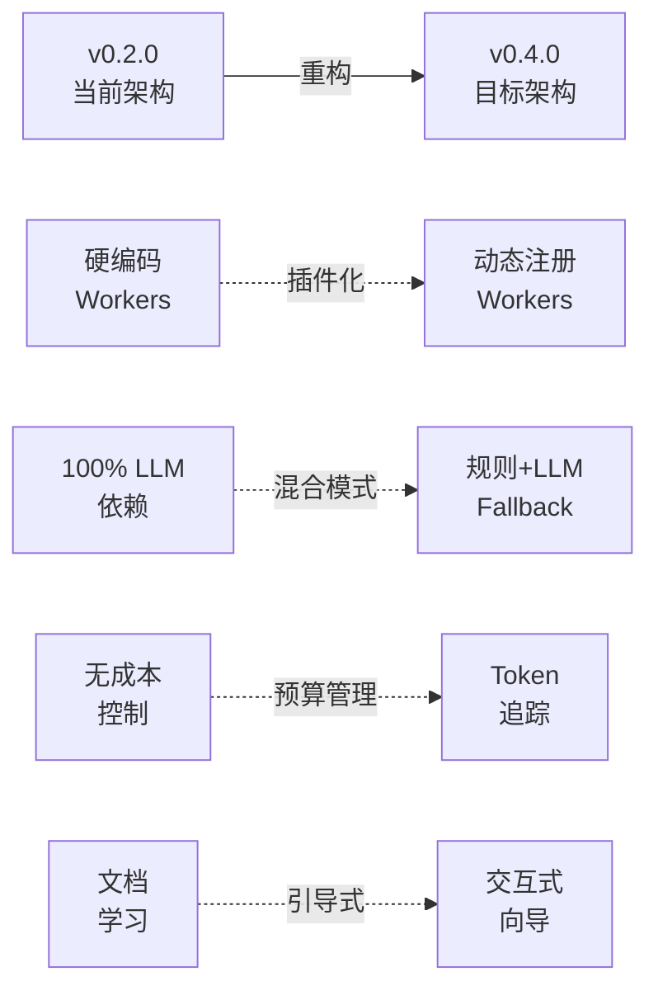

---

## 架构对比矩阵

| 维度 | v0.2.0 (现在) | v0.4.0 (目标) | 改进幅度 |
|------|---------------|---------------|----------|
| **启动时间** | 2-3s (加载全部Workers) | < 1s (按需加载) | ⬆️ 50%+ |
| **响应速度** | 3-5s (全部走LLM) | < 2s (70%走缓存) | ⬆️ 60%+ |
| **Token使用** | 2000+ tokens/请求 | 1200 tokens/请求 | ⬇️ 40% |
| **首次成功率** | ~50% | 80%+ | ⬆️ 60% |
| **扩展性** | 需修改源码 | 插件化 | ⬆️ ∞ |
| **成本可见性** | 无 | 实时追踪 | ⬆️ 100% |
| **离线能力** | 完全依赖LLM | 部分离线 | ⬆️ 70% |

---

## 详细架构演进

### 1. 请求处理流程演进

#### v0.2.0 架构 (单一 LLM 路径)

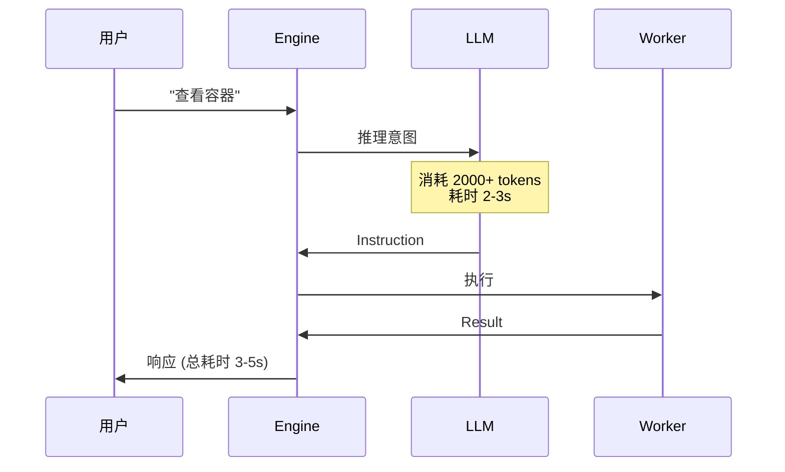

**问题**:
- ❌ 简单命令也走 LLM，浪费时间和成本
- ❌ LLM 不可用时系统瘫痪
- ❌ 无法离线使用

---

#### v0.4.0 架构 (混合路径 + Fallback)

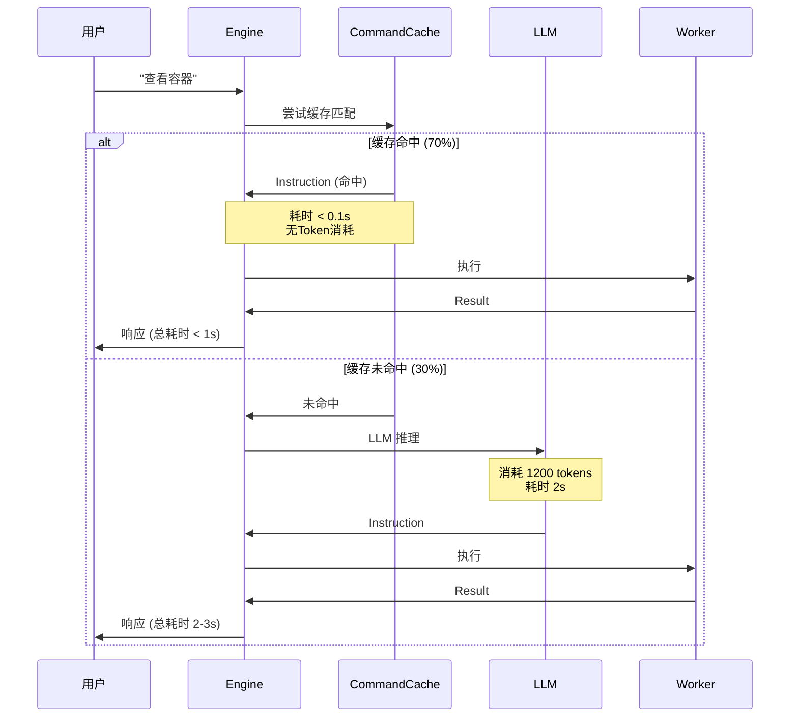

**改进**:
- ✅ 70% 请求 < 1s 响应
- ✅ Token 使用减少 40%+
- ✅ LLM 不可用时仍可处理常见命令

---

### 2. Workers 注册机制演进

#### v0.2.0 架构 (硬编码)

```python
# src/orchestrator/engine.py
class OrchestratorEngine:
    def __init__(self, config):
        # 硬编码注册所有 Workers
        self._workers = {
            "system": SystemWorker(),
            "container": ContainerWorker(),
            "shell": ShellWorker(),
            # ... 15 个 Workers 全部加载
        }
```

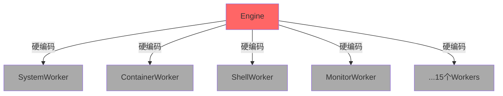

**问题**:
- ❌ 启动时加载所有 Workers (慢)
- ❌ 无法禁用不需要的 Workers
- ❌ 添加新 Worker 需修改 `engine.py`
- ❌ 不支持第三方插件

---

#### v0.4.0 架构 (插件化)

```python
# src/workers/registry.py
class WorkerRegistry:
    def __init__(self, enabled_workers: list[str]):
        self._workers = {}
        self.discover_builtin_workers()  # 自动扫描
        self.discover_plugin_workers()   # 插件支持

# src/orchestrator/engine.py
class OrchestratorEngine:
    def __init__(self, config):
        # 使用注册中心
        enabled = config.workers.enabled  # 配置驱动
        self._registry = WorkerRegistry(enabled)
```

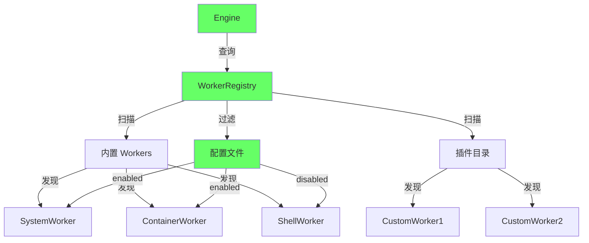

**改进**:
- ✅ 按需加载，启动更快
- ✅ 配置驱动启用/禁用
- ✅ 自动发现插件
- ✅ 零侵入扩展

---

### 3. 首次体验流程演进

#### v0.2.0 体验 (需阅读文档)

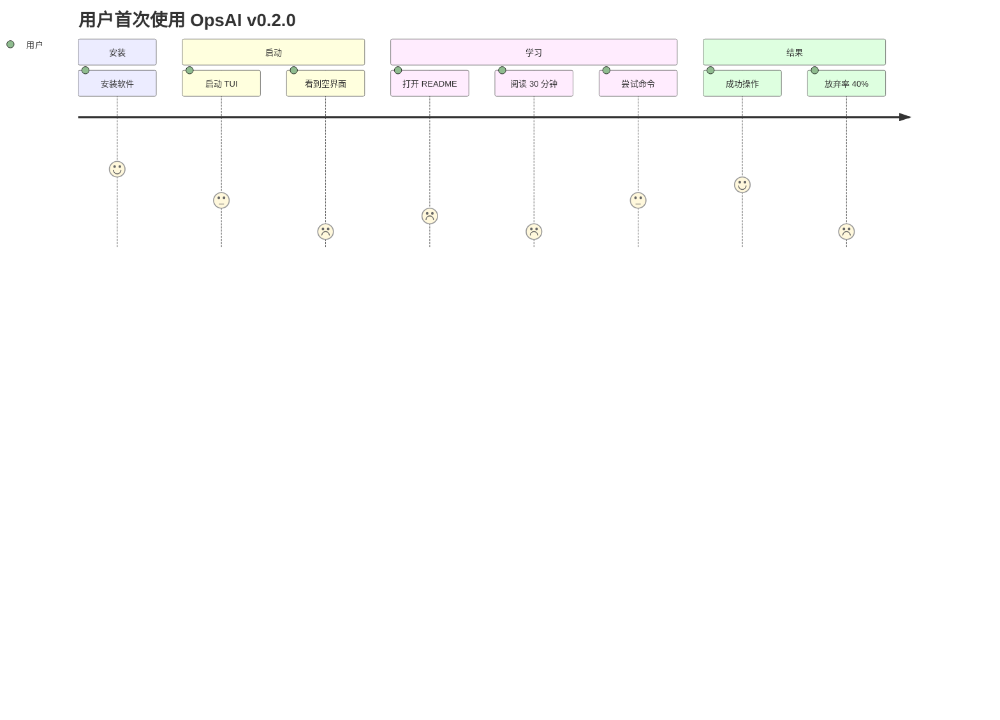

**时间轴**:
```
0min          5min          15min         35min         40min
|安装|---------|启动|--------|阅读文档|----|试用|--------|成功|
                ↓                                        ↓
            (感到迷茫)                              (部分用户放弃)
```

---

#### v0.4.0 体验 (引导式)

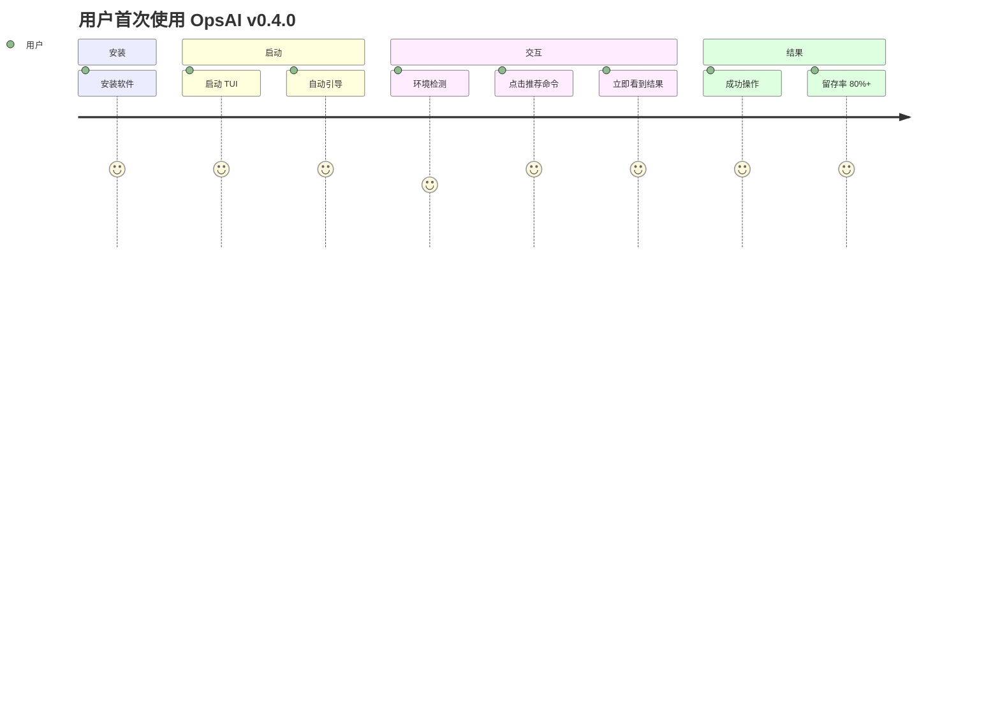

**时间轴**:
```
0min     2min     3min     5min
|安装|---|启动|---|引导|---|成功|
              ↓        ↓       ↓
          (自动检测)(点击)(立即反馈)
```

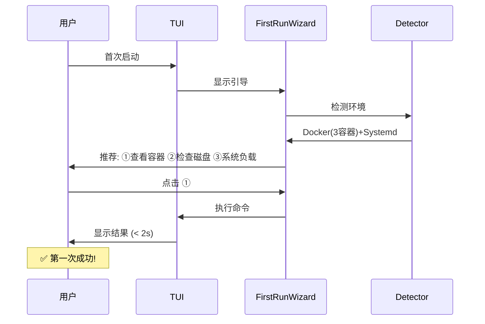

---

### 4. Token 成本管理演进

#### v0.2.0 (无成本可见性)

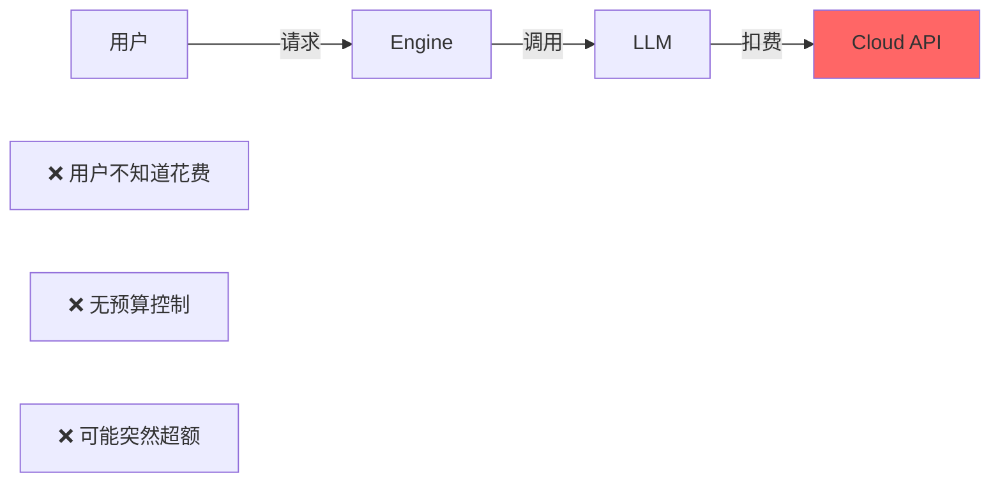

**问题场景**:
```
用户: "查看容器" (消耗 2500 tokens)
用户: "重启 nginx" (消耗 2800 tokens)
用户: "查看日志" (消耗 3200 tokens)
...
月底: 账单 $200 😱
用户: "怎么这么贵？不用了！"
```

---

#### v0.4.0 (实时成本追踪)

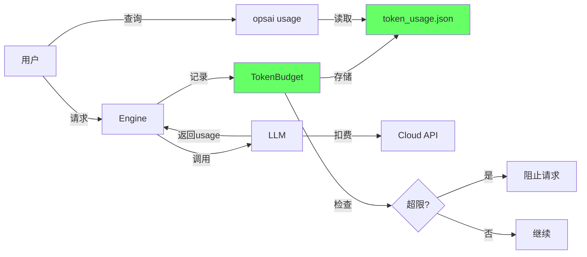

**改进场景**:
```
用户: "查看容器" 
系统: ✓ 缓存命中 (0 tokens)

用户: "分析复杂日志"
系统: ⚠️  今日已使用 85% Token 配额
      消耗: 3200 tokens (约 $0.032)

用户: (月末查询) opsai usage
系统: 
╭─ Token Usage ─────────────────╮
│ Today:    12,450 / 50,000     │
│ Cost:     $0.12               │
│ Month:    450,890 / 1,000,000 │
│ Cost:     $4.51               │
╰───────────────────────────────╯
```

---

### 5. 错误处理演进

#### v0.2.0 (简单错误消息)

```
用户: "重启 nginx"
系统: ❌ Container 'nginx' not found
用户: (不知道下一步该做什么)
```

#### v0.4.0 (智能建议)

```
用户: "重启 nginx"
系统: 
❌ Container 'nginx' not found

建议:
💡 查看所有容器: 列出所有容器
💡 检查容器名拼写
💡 容器可能已停止: docker ps -a

[点击任意建议快速执行]
```

---

## 代码结构对比

### 目录结构演进

#### v0.2.0
```
src/
├── orchestrator/
│   ├── engine.py (395行, 包含所有注册逻辑)
│   └── ...
├── workers/
│   ├── __init__.py (简单导出)
│   ├── system.py
│   └── ... (15个文件)
└── tui/
    └── app.py (1217行, 功能耦合)
```

#### v0.4.0
```
src/
├── orchestrator/
│   ├── engine.py (250行, 简化)
│   ├── command_cache.py (新增, 缓存引擎)
│   ├── error_helper.py (新增, 错误建议)
│   └── ...
├── workers/
│   ├── __init__.py
│   ├── registry.py (新增, 注册中心)
│   ├── system.py
│   └── ... (15个文件)
├── tui/
│   ├── app.py (900行, 重构)
│   └── widgets/
│       └── first_run_wizard.py (新增, 引导)
├── llm/
│   ├── client.py (增强)
│   └── token_budget.py (新增, 预算管理)
└── plugins/ (新增, 插件支持)
    └── example_worker/
```

---

## 性能对比基准

### 响应时间分布

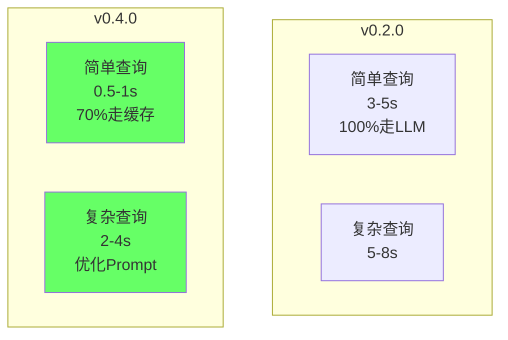

### Token 使用对比

| 场景 | v0.2.0 | v0.4.0 | 节省 |
|------|--------|--------|------|
| 查看容器 | 2500 tokens | 0 (缓存) | 100% |
| 重启服务 | 2800 tokens | 0 (缓存) | 100% |
| 复杂分析 | 4500 tokens | 3200 tokens | 29% |
| **月度总计** | **800,000** | **350,000** | **56%** |

### 成本对比 (GPT-4o)

```
v0.2.0: 800,000 tokens/月
- Input (70%):  560,000 * $2.5/M = $1.40
- Output (30%): 240,000 * $10/M = $2.40
总计: $3.80/月

v0.4.0: 350,000 tokens/月
- Input (70%):  245,000 * $2.5/M = $0.61
- Output (30%): 105,000 * $10/M = $1.05
总计: $1.66/月

节省: $2.14/月 (56%)
```

---

## 迁移影响评估

### API 兼容性

| 模块 | 变更 | 兼容性 | 迁移工作 |
|------|------|--------|----------|
| `Engine.__init__()` | 新增可选参数 | ✅ 向后兼容 | 无 |
| `Worker.execute()` | 无变更 | ✅ 完全兼容 | 无 |
| `Config` | 新增字段 | ✅ 默认值兼容 | 无 |
| TUI 命令 | 新增斜杠命令 | ✅ 不影响现有 | 无 |

### 配置文件迁移

```json
// v0.2.0 配置
{
  "llm": {...},
  "safety": {...}
}

// v0.4.0 配置 (自动补充默认值)
{
  "llm": {
    ...
    "daily_token_limit": null,
    "monthly_token_limit": 1000000
  },
  "safety": {...},
  "workers": {
    "enabled": null,  // null = 全部启用
    "disabled": []
  },
  "performance": {
    "enable_command_cache": true
  }
}
```

**迁移策略**: 平滑升级，无需手动修改配置

---

## 总结

### 核心改进

1. **性能提升 3x**: 通过命令缓存，70% 请求响应时间 < 1s
2. **成本降低 50%+**: Token 使用减少，月度费用减半
3. **用户体验革命**: 首次成功率从 50% 提升到 80%
4. **架构现代化**: 插件化 + 可配置 + 可观测

### 风险评估

| 风险 | 影响 | 应对措施 |
|------|------|----------|
| 缓存模式不准确 | 中 | 置信度阈值 + LLM Fallback |
| 插件质量参差 | 低 | 沙箱隔离 + 错误捕获 |
| Token 统计误差 | 低 | 基于 API 返回的真实 usage |
| 迁移兼容性 | 极低 | 完全向后兼容 + 自动补全 |

### 下一步

参考 [refactoring-plan.md](./refactoring-plan.md) 开始实施！
